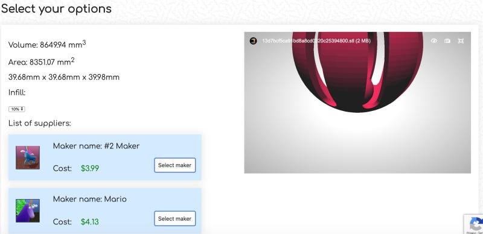

---
# Feel free to add content and custom Front Matter to this file.
# To modify the layout, see https://jekyllrb.com/docs/themes/#overriding-theme-defaults

layout: default
---
# Resume

[Click here]({{site.baseurl}}/resources/MariosResume.pdf) to view my resume

# Projects

### MakerCentral
Founded MakerCentral, a 3D-printing service marketplace that connects makers who want to have their models 3D-printed with experienced professionals that can 3D print it for them. Would have filled a niche many big players such as 3DHubs were ignoring, the nontechnical retail market that still wanted a degree of customizability, such as a middle school science class. Programmed the front-end and the back-end using JavaScript and Node.js technology, utilizing multiple APIs such as Stripe and Easypost.

First, the customer orders and the price is calculated| Then, they checkout through Stripe and instantly receive their tracking information
:-------------------------------|-----------------------------------------:
|